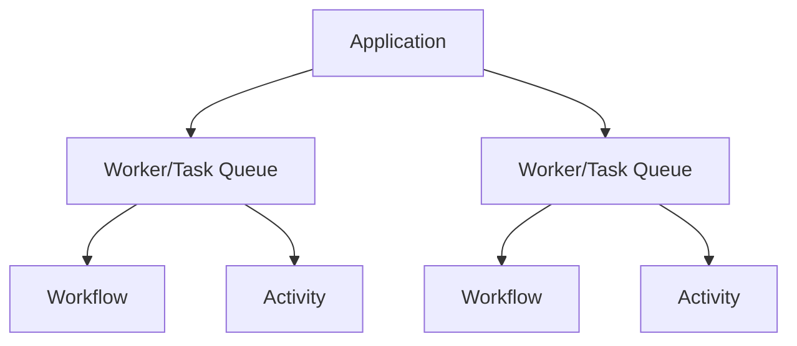

# Coroutine Scopes

Temporal KT heavilly utilizes kotlin coroutine which follow predictable scoped patterns. These scopes directly control
i.e. what threads a workflow can run on, and its cancellations.



## WorkflowContext / ActivityContext Scope

When inside a workflow or activity method, the `WorkflowContext` or `ActivityContext` is the coroutine scope.
This means if you launch child coroutines you should use `this` as the scope to ensure proper cancellation and context propagation.

```kotlin
@Workflow("MyWorkflow")
class MyWorkflow {
    @WorkflowRun
    suspend fun WorkflowContext.execute(arg: WorkflowArg): String {
        // Correct: uses WorkflowContext scope
        // Do not use MainScope or GlobalScope here otherwise you can cause memory leaks

        val result = async {
            // do some concurrent work
        }.await()
    }
}
```

If you need to specify your own scope you can use "withContext(...`)` to switch to the desired context.".

When a workflow or activity is canceled, all child coroutines launched within its scope should also be canceled
automatically.


```kotlin
@Activity("MyActivity")
class MyActivity {
    @ActivityMethod
    suspend fun ActivityContext.greet(name: String): String {
        // Switch to IO dispatcher for blocking calls
        return withContext(Dispatchers.IO) {
            // blocking call here
            "Hello, $name"
        }
    }
}
```

## Workflow Interop

Temporal SDKs have their own 'async' and 'wait' system which need to be delegated to coroutines seamlessly

Java SDK example
```java
Promise<String> asyncResult = Async.function(() -> {
    // do some work
    return "result";
});
String result = asyncResult.get();
```

Optimal Kotlin SDK equivalent
```kotlin
val result: String = WorkflowContext.async {
    // do some work
    "result"
}.await()
```

This interop may be possible entirely from a custom 
[CoroutineDispatcher](https://kotlinlang.org/api/kotlinx.coroutines/kotlinx-coroutines-core/kotlinx.coroutines/-coroutine-dispatcher/)


## Scope Leak Prevention

Using a coroutine scope not from the WorkflowContext can lead to non determinism issues (and probably just break)...

```kotlin
@Workflow("MyWorkflow")
class MyWorkflow {
    @WorkflowRun
    suspend fun WorkflowContext.execute(arg: WorkflowArg): String {
        // Incorrect: using GlobalScope can lead to leaks and non-determinism
        val result = GlobalScope.async {
            // do some concurrent work
        }.await()
    }
}
```

~~So at runtime, we can throw an exception if the user escapes.~~
Runtime checks are actually limited with coroutine SDK (without internal usage) so this will have to rely on the 
compiler plugins.
